# Family inFluency - Getting Started Guide

This guide covers two user journeys:

1. **Super Admin** - How you (the owner) log in, create circles, and share invite links
2. **New User** - How someone you invite joins their circle and creates their profile

---

## Guide A: Super Admin Flow

This is your flow as the app owner. You'll log in, manage all circles from the Owner Dashboard, create new circles, and share Family & Friends Circle Keys with people.

---

### Step 1: Open the App

Open the app in your browser. You'll see the **Gate screen** with the Family & Friends Circle Key input and the wax seal icon.

At the bottom, notice the **"Super Admin Login"** link.

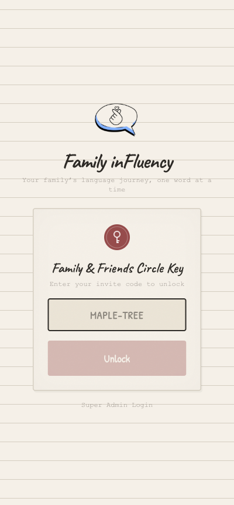

---

### Step 2: Tap "Super Admin Login"

Tap the **"Super Admin Login"** link at the bottom of the Gate screen.

The card flips to show the **Super Admin** login form with an email input field.

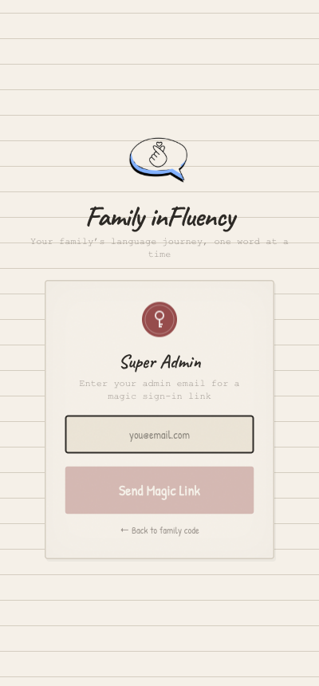

---

### Step 3: Enter Your Admin Email

Type your admin email address (**joyirhyss@gmail.com**) into the email field.

The **"Send Magic Link"** button activates (turns dark) once you've entered a valid email.

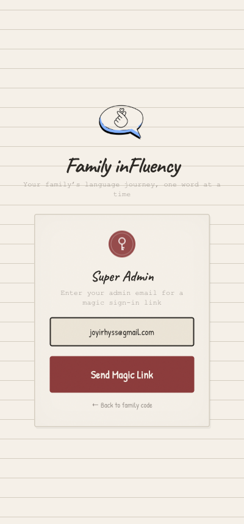

---

### Step 4: Tap "Send Magic Link" & Check Your Email

Tap the **"Send Magic Link"** button. The screen confirms with a **"Check your inbox"** message.

**Go to your Gmail inbox** and look for an email from Family inFluency. Click the magic link in that email - it will open the app and automatically sign you in.

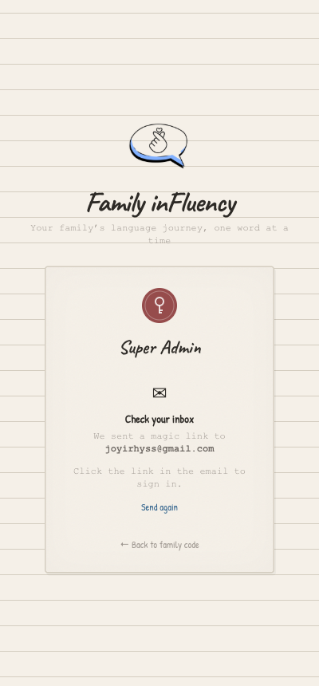

---

### Step 5: Owner Dashboard

After clicking the magic link in your email, you land on the **Owner Dashboard**. This is your command center for managing all circles.

You'll see:
- **Circle count** at the top (e.g., "13 of 20 circles")
- **Instructions card** explaining how Family & Friends Circle Keys work
- **"+ Create New Circle"** button
- **All existing circles** listed as cards, each showing:
  - Circle name and code
  - Member count (e.g., 0/10)
  - **FAMILY & FRIENDS CIRCLE KEY** - the magic link URL
  - **Copy Link** - copies the link to your clipboard for sharing
  - **Enter** - enters that circle to manage it
  - **Remove** - deletes the circle (not available on your own circle)

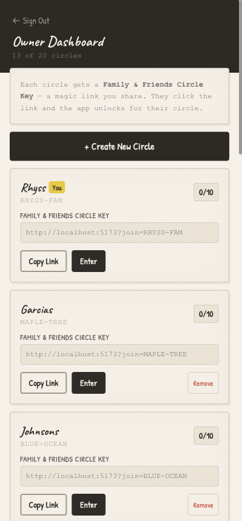

Scroll down to see all your inFluency circles (1 through 10) with their unique codes:

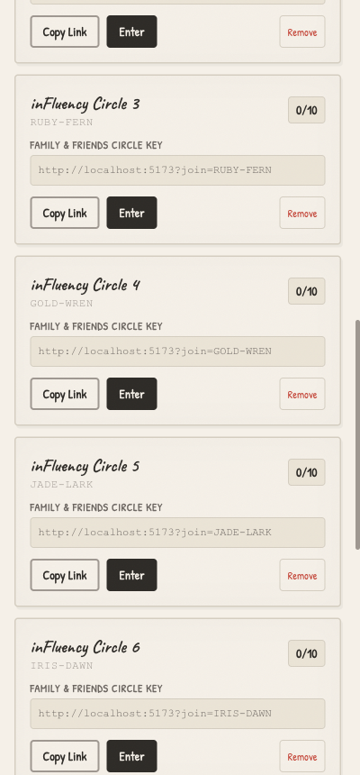

---

### Step 6: Create a New Circle

Tap **"+ Create New Circle"**. A form appears asking for a circle name.

The instructions say: *Give your circle a name (e.g. "The Garcias"). A unique Circle Key will be generated automatically.*

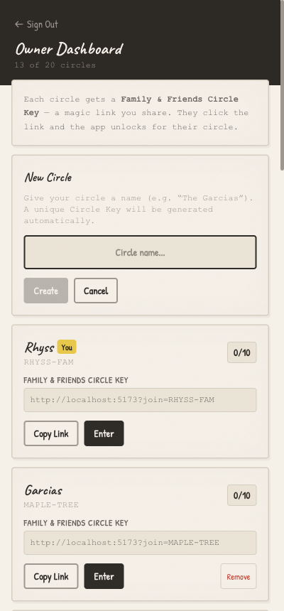

---

### Step 7: Name Your Circle & Create

Type the circle name (e.g., **"The Smiths"**) and tap **"Create"**.

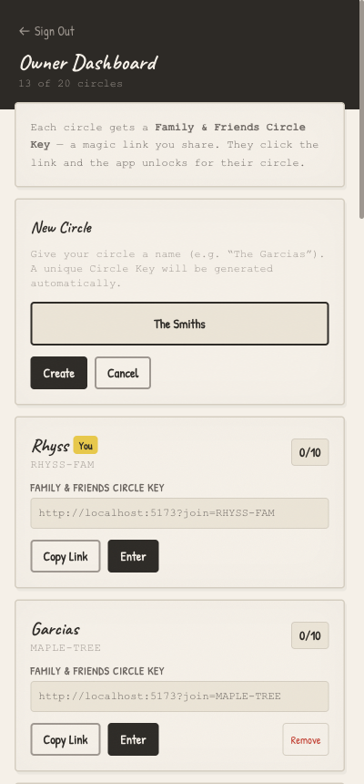

---

### Step 8: New Circle Appears

The new circle appears at the bottom of the list with:
- The name you entered (**The Smiths**)
- An auto-generated code (e.g., **VALE-SNOW**)
- Its own **Family & Friends Circle Key** link ready to share
- The counter updates (e.g., "14 of 20 circles")

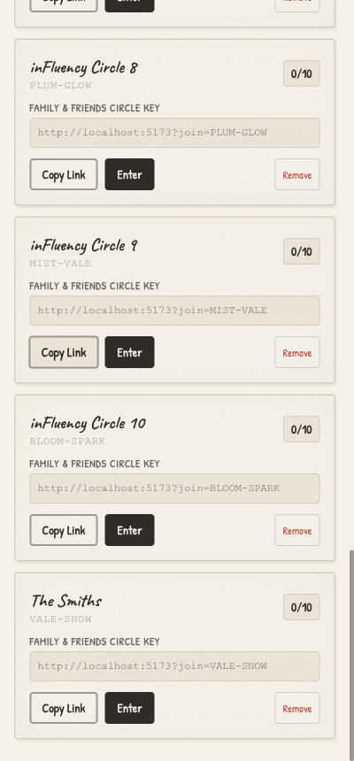

---

### Step 9: Share the Circle Key

To invite someone to a circle:

1. Find the circle card on the Owner Dashboard
2. Tap **"Copy Link"** - the magic link is copied to your clipboard
3. **Paste and send** the link via text message, email, WhatsApp, etc.

The link looks like: `http://localhost:5173?join=CORAL-WIND`
(In production this will be your real domain, e.g., `https://influency.app?join=CORAL-WIND`)

The recipient simply clicks the link and the app opens directly to their circle - no code typing needed!

---

### Step 10: Enter a Circle to Manage It

Tap **"Enter"** on any circle card to go into that circle. You'll see the **Splash screen** showing the family name and member count.

From here you can:
- **Open Notebook** to see all members and manage the circle
- **Add Family Member** to create profiles

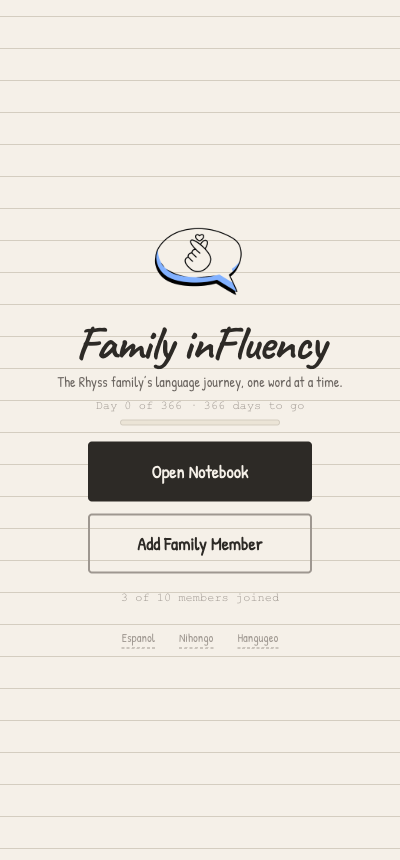

---

### Important Notes for Super Admin

- **Your super admin access is tied to your email** (joyirhyss@gmail.com), not to any player profile. Deleting a player profile will NOT affect your admin access.
- **"Creator" badge** on a player card means they were the first person to join that circle - it does NOT mean they are the super admin.
- **You can delete any member** from any circle, including the first member (Creator), when logged in as super admin.
- **You can create up to 20 circles** total.
- **Each circle can have up to 10 members.**

---
---

## Guide B: New User Flow (Invited Person)

This is the flow for someone you've sent a Family & Friends Circle Key link to. They've never used the app before.

---

### Step 1: Click the Invite Link

You receive a link from the circle owner (via text, email, etc.) that looks like:

```
http://localhost:5173?join=CORAL-WIND
```

**Click the link.** The app opens and automatically validates your code.

---

### Step 2: Welcome Splash Screen

The app opens directly to the **Splash screen** for your circle. You'll see:
- **"Family inFluency"** title
- Your circle name (e.g., *"The inFluency Circle 1 family's language journey"*)
- A **"Get Started"** button
- Available languages at the bottom

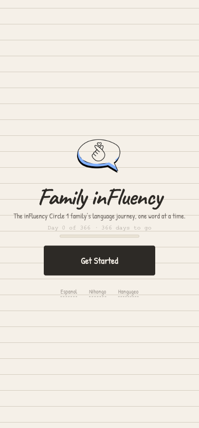

---

### Alternative: Enter Code Manually

If someone gave you the code as text (not a clickable link), you can type it manually:

1. Open the app
2. Type the code (e.g., **CORAL-WIND**) into the "Family & Friends Circle Key" field
3. Tap **"Unlock"**

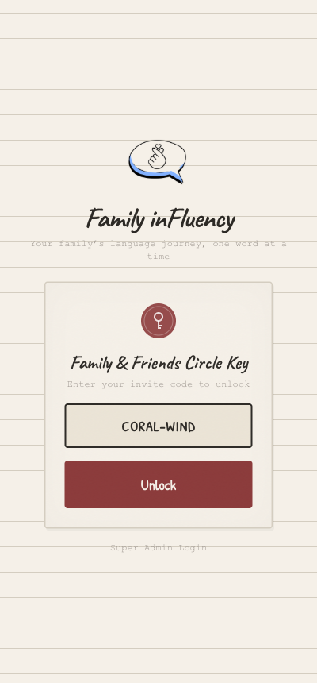

---

### Step 3: Tap "Get Started" & Fill Out Your Profile

Tap **"Get Started"** to open the **Join form**. Fill in:

1. **Your Name** - Type your first name
2. **Languages** - Pick one or more languages to learn (Spanish, Japanese, Korean)
3. **Learning Goals** - Select what you want to learn for (Travel, Medical, Professional, etc.)
4. **Starting Level** - Set your level for each language (Starter through Fluent)
5. **Your Secret Key** - Enter 3 digits to protect your profile

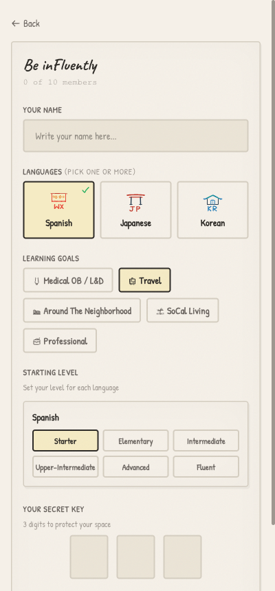

---

### Step 4: Complete Your Profile

Once all fields are filled in - name, language(s), goal(s), level, and 3-digit secret key - the **"Start My Year"** button activates at the bottom.

Tap **"Start My Year"** to create your profile and enter the app!

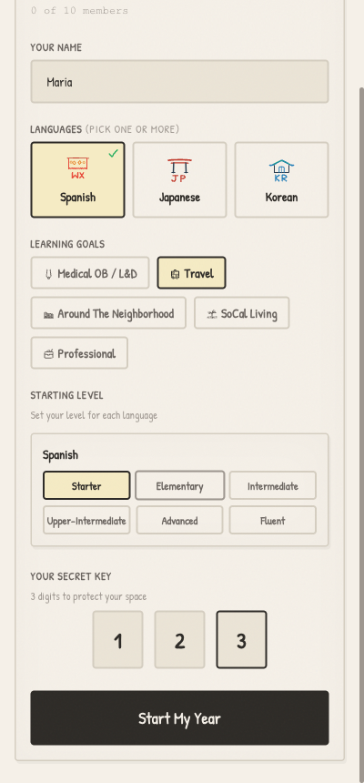

---

### Step 5: You're In! Welcome to the Home Screen

You land on the **Home screen** with your profile card showing:
- Your name and avatar
- Language and level
- XP progress bar
- **"One word for today?"** - your daily word prompt
- **"Year of Words"** tracker (Day 0 of 366)
- **"inFluency State"** goal tracker

You're all set! Start your language journey.

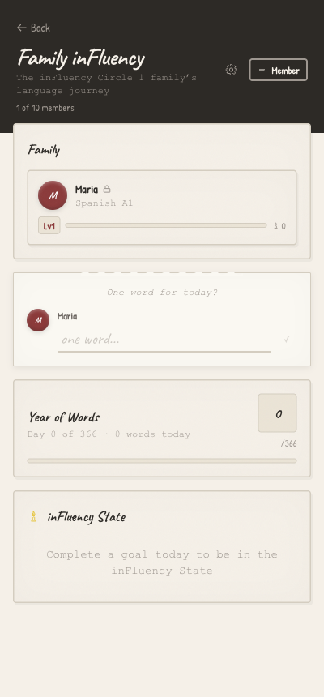

---

## Quick Reference: Circle Codes

Here are all the pre-loaded circles and their codes:

| Circle Name | Code | Share Link |
|---|---|---|
| Rhyss (Owner) | RHYSS-FAM | `?join=RHYSS-FAM` |
| Garcias | MAPLE-TREE | `?join=MAPLE-TREE` |
| Johnsons | BLUE-OCEAN | `?join=BLUE-OCEAN` |
| inFluency Circle 1 | CORAL-WIND | `?join=CORAL-WIND` |
| inFluency Circle 2 | SAGE-MOON | `?join=SAGE-MOON` |
| inFluency Circle 3 | RUBY-FERN | `?join=RUBY-FERN` |
| inFluency Circle 4 | GOLD-WREN | `?join=GOLD-WREN` |
| inFluency Circle 5 | JADE-LARK | `?join=JADE-LARK` |
| inFluency Circle 6 | IRIS-DAWN | `?join=IRIS-DAWN` |
| inFluency Circle 7 | TEAL-COVE | `?join=TEAL-COVE` |
| inFluency Circle 8 | PLUM-GLOW | `?join=PLUM-GLOW` |
| inFluency Circle 9 | MIST-VALE | `?join=MIST-VALE` |
| inFluency Circle 10 | BLOOM-SPARK | `?join=BLOOM-SPARK` |

To build a full share link, prepend your domain:
`https://yourdomain.com?join=CORAL-WIND`
